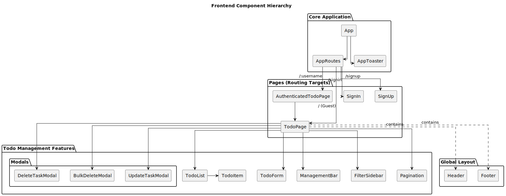
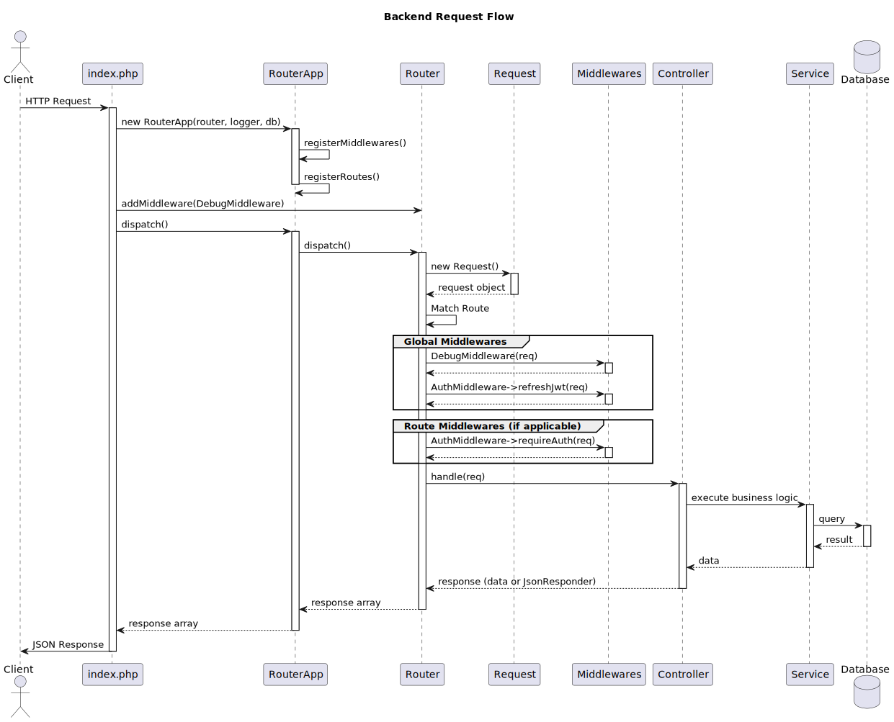

# Todo

> **Note:** This is a **personal project** built primarily for my own daily task management and learning. While it is open source, features are prioritized based on my personal needs and workflows.

A robust, full-stack to-do list application built with a modern PHP backend and a reactive frontend. It demonstrates a clean architecture without relying on heavy frameworks, focusing on performance, maintainability, and a premium user experience.

## Deployment

This application is built for personal use and is currently running in production on free-tier providers:

- **Frontend**: Hosted on Vercel.
- **Backend**: Hosted on Render.

While I do not maintain public demo links, the codebase is production-ready. You can refer to `./scripts/render.sh` or the Docker configurations if you wish to deploy your own instance.

## Features

### Authentication & Security

- **Secure Session Management**: Uses **HTTP-only cookies** for storing JWTs (Access & Refresh tokens), preventing XSS attacks.
- **Auto-Refresh Strategy**: Seamlessly refreshes access tokens in the background, keeping users logged in without interruption.
- **Robust Auth Flow**: Signup, Signin, and Signout with comprehensive validation.

### Task Management

- **Optimistic UI**: Interface updates instantly for adding, deleting, and completing tasks, providing a snappy experience.
- **Batch Operations**: Support for bulk deletion and bulk status updates.
- **Persistence**: Data is reliably stored in a MySQL database.

### User Experience (UI/UX)

- **Modern Design**: Built with **React 19** and vanilla CSS variables for a clean, custom aesthetic.
- **Responsive Layout**: Fully responsive design that works on desktop, tablet, and mobile.
- **Dark Mode**: Native support for system color schemes (Light/Dark).
- **Smooth Interactions**: Integrated **Lenis** for smooth scrolling and **React Hot Toast** for non-intrusive notifications.

## Technology Stack

### Frontend



- **Runtime**: [Bun](https://bun.sh) (Fast JavaScript runtime & package manager)
- **Framework**: [React 19](https://react.dev)
- **Build Tool**: [Vite](https://vitejs.dev)
- **State & Networking**: [TanStack Query](https://tanstack.com/query/latest) (for efficient data fetching and caching)
- **Routing**: [React Router v7](https://reactrouter.com)
- **Styling**: Vanilla CSS (CSS Modules/Variables) - No heavy CSS frameworks.
- **Testing**: [Vitest](https://vitest.dev) + React Testing Library

### Backend



- **Language**: PHP 8.3+
- **Architecture**: Custom lightweight **Router**, Dependency Injection, and Middleware system (no framework).
- **Database**: MySQL 8.0
- **Migrations**: [Phinx](https://phinx.org)
- **Testing**: PHPUnit 12 (Unit, Integration, E2E)
- **Static Analysis**: PHPStan (Level Max)

### Infrastructure

- **Docker**: Full containerization for Dev and Test environments.
- **Nginx**: Serves as the web server and reverse proxy.
- **Shell Scripts**: Custom utility scripts (`scripts/*.sh`) for simplified management.

## Getting Started (Development)

This project uses Docker to ensure a consistent development environment.

### Prerequisites

- Docker & Docker Compose
- Bun (for local frontend tooling, optional if using Docker for everything)

### 1. Start the Environment

The project is managed via a helper script in the root directory. This command spins up the MySQL database, PHP backend, Nginx, and PHPMyAdmin containers.

```bash
cd backend

composer up
# OR manually: ./scripts/dev.sh up
```

### 2. Run Database Migrations

Once the containers are running, you need to set up the database schema:

```bash
cd backend

composer phinx:migrate
```

### 3. Frontend Setup

The frontend is located in the `frontend/` directory.

```bash
cd frontend

# Install dependencies
bun install

# Start the dev server
bun dev
```

The frontend will be available at `http://localhost:5173` and acts as a proxy to the backend API.

## Testing

The project emphasizes high test coverage to ensure stability.

### Backend Tests

Runs Unit, Integration, and E2E tests within the Docker environment.

```bash
cd backend
composer test
```

### Frontend Tests

Runs component and logic tests using Vitest.

```bash
cd frontend
bun test
```

## License

This project is open-sourced software licensed under the [MIT license](https://opensource.org/licenses/MIT).
